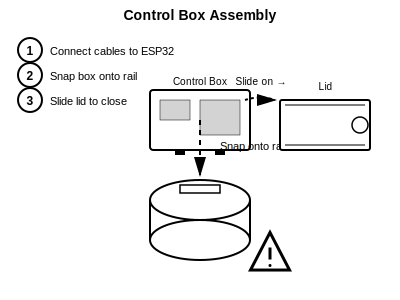

# ShopVac Rat Trap - Assembly Guide

> [!NOTE]
> **Tool-Free Assembly**: No screws or screwdrivers required for the main body. Parts snap and twist together.

## 1. Module Overview

*Identify your printed parts: Entrance, Sensor Module, Bait Station, Control Box.*

## 2. Connect Modules (Twist-Lock)

1. Align the **dots** on the tubes.
2. Push together.
3. **Twist** clockwise until it clicks.

## 3. Route Cables

1. Feed sensor wires into the **top channel**.
2. Ensure connectors pass all the way through to the Control Box end.

## 4. Install Sensors

1. Press sensors into their mounts.
2. **Snap** the covers on to secure them.

## 5. Attach Control Box

1. **Install the 30mm Arcade Button** into the side hole and secure with its nut.
2. Plug cables into the ESP32 and connect the button.
3. Snap the Control Box onto the rear rail.
4. Slide the lid closed.

## 6. Bait & Arm

1. Unscrew the Bait Cap.
2. Add peanut butter.
3. Screw cap back on tight.
