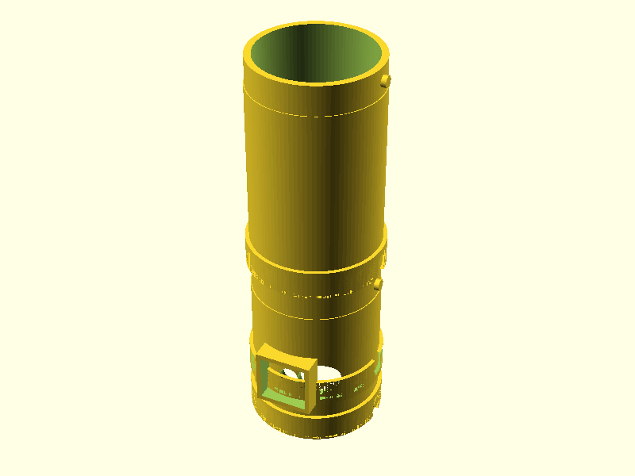
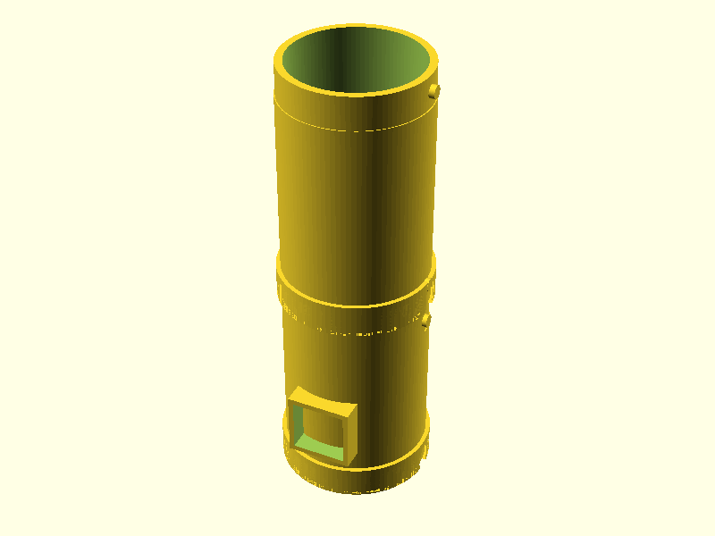
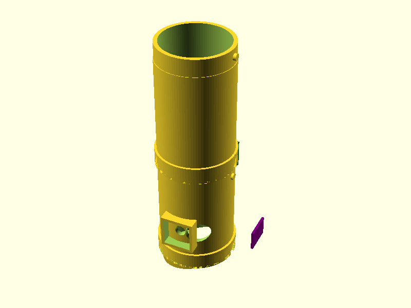

# ShopVac Rat Trap - Assembly Guide

## Assembly Overview

This guide covers the physical assembly of the ShopVac Rat Trap system.

**Design:** Modular Twist-Lock Tube System with Integrated Cable Channels
**Assembly Time:** ~1-2 hours (excluding printing)
**Tools Required:**
*   Wire strippers/cutters
*   Small flathead screwdriver (for terminal blocks)
*   *No screws required for main trap body assembly!*

**Safety:** This system uses 120V/230V AC. Follow all safety precautions.

---

## 1. Required Components

See [Bill of Materials](bom.md) for complete parts list.

### 3D Printed Parts
*   **Modules**:
    *   `trap_entrance.stl` (Sensor mounts, bottom section)
    *   `trap_body_front.stl` (Main body extension)
    *   `trap_body_rear.stl` (Rear section)
    *   `vacuum_funnel.stl` (Shop vac adapter)
    *   `bait_station.stl` (Side mount)
*   **Control Box**:
    *   `control_box_enclosure.stl`
    *   `control_box_lid.stl`
*   **Mounts**:
    *   `sensor_mount.stl` (For PIR/ToF)
    *   `camera_mount.stl` (Optional)

## 2. 3D Printing

All parts are designed to be printed without supports if oriented correctly.

### Recommended Settings
- **Material**: PETG or ASA (PLA is not recommended for durability/outdoors).
- **Layer Height**: 0.2mm.
- **Infill**: 40% Gyroid (for strength).
- **Wall Thickness**: **4mm** (Critical for chew resistance).

---

## 3. Mechanical Assembly (Twist-Lock)

The new modular design uses a tool-free twist-lock mechanism to connect the trap sections.

### Step 1: Prepare Parts & Sensors
1.  Remove any brim or stringing from prints.
2.  Ensure sensor ports and cable channels are clear of debris.
3.  **Pre-connect STEMMA QT cables** to your sensors (VL53L0X, APDS9960, PIR) *before* mounting.

### Step 2: Connect Modules

1.  **Align**: Line up the alignment dots/marks on the mating tubes (e.g., `trap_entrance` to `trap_body_front`).
2.  **Push**: Push the sections together firmly.
3.  **Twist**: Twist clockwise until you feel the lock click into place.
4.  Repeat for all tube sections (`vacuum_funnel` -> `trap_body` -> `trap_entrance`).

### Step 3: Route Cables
The system features **integrated cable channels** to protect wires from rodents.



1.  **Feed Wires**: As you connect modules, ensure the sensor wires feed into the top cable channel.
2.  **Pass-Through**: The channels align perfectly when the twist-lock is engaged.
3.  **Exit**: All cables should exit at the rear, near the Control Box mounting point.

### Step 4: Install Sensors

1.  **VL53L0X (ToF)**: Press into the top mount on the `trap_entrance`.
2.  **PIR Sensor**: Press into the side mount.
3.  **APDS9960**: Install in the `bait_station` mount.
4.  **Secure**: Snap the printed sensor covers (`sensor_mount.stl`) over the sensors to lock them in place.

### Step 5: Attach Control Box
1.  **Mount**: Snap the Control Box onto the rear rail/mount of the trap body.
2.  **Gland**: Pass the cable bundle through the cable gland on the control box.
3.  **Button**: Install the 30mm Arcade Button into the side hole of the control box.

### Step 6: Bait & Arm
1.  Unscrew the Bait Cap on the `bait_station`.
2.  Add bait (e.g., peanut butter).
3.  Screw the cap back on tight.

---

## 4. Electrical Wiring

> [!WARNING]
> **High Voltage Hazard**: This project controls mains voltage (120V/240V). Ensure the device is unplugged while wiring the relay.


> [!TIP]
> For the complete system wiring diagram, see the **[Wiring Diagram](../WIRING_DIAGRAM.md)**.

### Connections

| Component | ESP32 Pin | Notes |
|-----------|-----------|-------|
| **I2C Bus A** | SDA=GPIO3, SCL=GPIO4 | Primary Bus (Sensors & Display) |
| **SSR Control** | GPIO5 | Output to Optocoupler (Active High) |
| **Emergency Stop** | GPIO6 | Input (Active Low, Pull-up) |
| **Reset Button** | GPIO9 | Input (Active Low, Pull-up) |
| **IR LED** | GPIO21 | Night Vision Illumination |
| **Camera Module** | GPIO10-18, 38, 40-41, 47-48 | See Pinout Diagram for details |

### Power Distribution
- **ESP32**: Powered via USB-C or 5V regulator.
- **Sensors**: 3.3V from ESP32 regulator (ensure total current < 500mA).
- **Vacuum**: Switched via SSR/Relay on the Live wire.

### Cable Routing Details
*   **Internal Channels**: 6mm wide, fully enclosed.
*   **Protection**: 4mm thick walls prevent rodent access.
*   **Slack**: Leave ~10cm service loop inside the control box.

---

## 5. Firmware Flashing

1.  **Install ESPHome**: `pip install esphome`
2.  **Connect**: Plug ESP32 into computer via USB.
3.  **Flash**:
    ```bash
    # For Standard Version
    esphome run esphome/rat-trap.yaml

    # For Camera Version
    esphome run esphome/rat-trap-stemma-camera.yaml
    ```
4.  **Verify**: Check logs for "WiFi Connected" and sensor initialization.

---

## 6. Testing & Calibration

1.  **Sensor Check**: Use the OLED display or Web Interface to verify all sensors show "OK".
2.  **Thresholds**: Adjust `detection_threshold` (ToF) and `apds_proximity_threshold` in the Web UI if needed.
3.  **Dry Run**: Use the "Manual Trigger" button in the Web UI to test the vacuum activation (ensure vacuum is connected!).

---

## 7. Maintenance

To ensure reliable operation and safety:

*   **Monthly**:
    *   Clean the sensor lenses (ToF, Proximity, PIR) with a soft cloth.
    *   Inspect cable glands and connections for tightness.
    *   Verify the trap is clear of debris.
*   **Quarterly**:
    *   Test the **Emergency Stop** button.
    *   Check for firmware updates.
    *   Inspect the 3D printed parts for any signs of wear or chewing.
*   **Annually**:
    *   Perform a full electrical safety inspection.
    *   Replace the fuse if it shows signs of oxidation or age.
