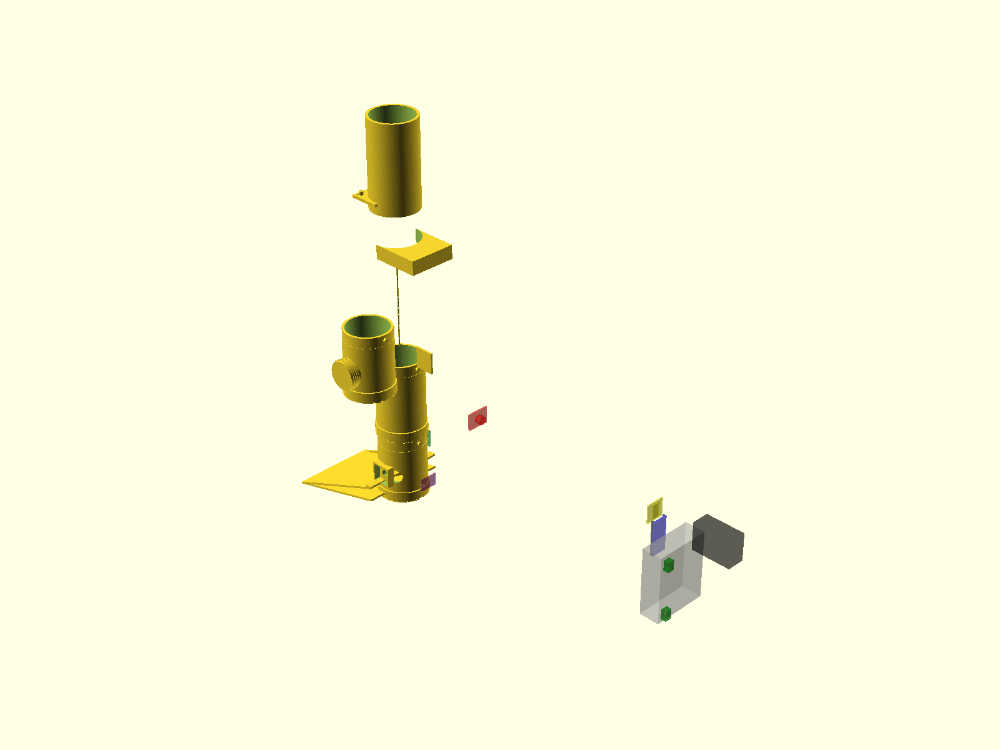
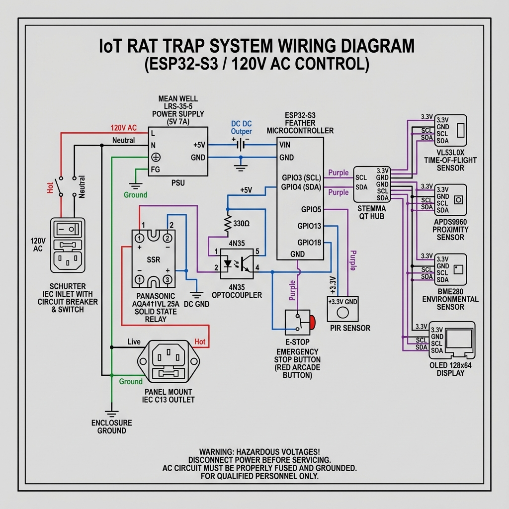

# ShopVac Rat Trap - Assembly Guide

## Assembly Overview

This guide covers the physical assembly of the ShopVac Rat Trap system.

**Design:** Horizontal tube trap with flat ramp entrance

**Assembly Sequence:**
1. Print all 3D components (48-60 hours total)
2. Install sensors in mounts
3. Route cables through integrated channels
4. Assemble trap sections
5. Wire control box electronics
6. Connect to shop vacuum

**Safety:** This system uses 120V AC. Follow all safety precautions.

---

## 1. Required Components

See [Bill of Materials](bom.md) for complete parts list.

### 3D Printed Parts
- trap_ramp_entrance (flat ramp, no supports)
- trap_entrance (sensor mounts)
- trap_body_front (125mm with cable channel)
- trap_body_rear (125mm)
- vacuum_funnel (shop vac adapter)
- control_box_enclosure
- Accessories (lid, bezels, mounts)

## 2. 3D Printing

All parts are designed to be printed without supports if oriented correctly.

### Recommended Settings
- **Material**: PETG or ABS (PLA is not recommended for durability).
- **Layer Height**: 0.2mm.
- **Infill**: 40% Gyroid (for strength).
- **Wall Thickness**: **4mm** (Critical for chew resistance).

### Parts List
| File | Description | Notes |
|------|-------------|-------|
| `trap_body_main.stl` | Main tube body | Print vertically. |
| `trap_entrance.stl` | Bottom entrance with sensor mounts | Print flat side down. |
| `vacuum_funnel.stl` | Funnel connecting to vacuum hose | Print flange down. |
| `bait_station.stl` | Side bait holder | Print with opening up. |
| `camera_mount.stl` | (Optional) Camera clamp | Print in two parts. |

---

## 2. Mechanical Assembly



### Steps
1.  **Prepare Parts**: Remove any brim or stringing from prints. Ensure sensor ports are clear.
2.  **Install Inserts**: Heat-set M3 threaded inserts into all mounting holes (sensor mounts, flange connections).
3.  **Assemble Body**:
    *   Attach `vacuum_funnel` to the top of `trap_body_main` using M3x10mm screws.
    *   Attach `trap_entrance` to the bottom of `trap_body_main`.
    *   Screw the `bait_station` into the side port.
4.  **Mount Sensors**:
    *   Secure VL53L0X to the top mount on `trap_entrance`.
    *   Secure PIR sensor to the side mount on `trap_body_main`.
    *   Secure APDS9960 to the bait station mount.
5.  **Camera (Optional)**: Clamp the camera mount to the top of the tube and secure the OV5640.

---

## 3. Electrical Wiring

> [!WARNING]
> **High Voltage Hazard**: This project controls mains voltage (120V/240V). Ensure the device is unplugged while wiring the relay.



### Connections

| Component | ESP32 Pin | Notes |
|-----------|-----------|-------|
| **I2C Bus (Primary)** | SDA=GPIO3, SCL=GPIO4 | APDS9960, VL53L0X, BME280, OLED, Hub |
| **I2C Bus (Camera)** | SDA=GPIO8, SCL=GPIO9 | OV5640 Camera (Optional) |
| **PIR Sensor** | GPIO13 | Input (Pull-down) |
| **SSR Control** | GPIO5 | Output to Optocoupler (Active High) |
| **IR LED Control** | GPIO6 | High-Power IR LED (Camera variant) |
| **Emergency Stop** | GPIO18 | Arcade Button (Pull-up, Inverted) |
| **Reset Button** | GPIO10 | Reset/Test Button |

### Power Distribution
- **ESP32**: Powered via USB-C or 5V regulator.
- **Sensors**: 3.3V from ESP32 regulator (ensure total current < 500mA).
- **Vacuum**: Switched via SSR/Relay on the Live wire.

### Cable Routing & Rodent Protection

All STEMMA QT cables route through **integrated channels** built into the 3D printed trap structure for complete rodent protection.

**Cable Path:** Sensor Mounts → Trap Entrance → Trap Body → Control Box

#### Routing STEMMA QT Cables

1. **Sensor Connections** (Inside Trap Entrance):
   - Connect sensors to STEMMA QT cables before mounting
   - Position JST SH connectors in connector pockets (8×10mm recesses)
   - Connectors snap into pockets near each sensor mount
   - Cable exits route to central junction

2. **Central Junction** (Trap Entrance Top):
   - Gather all sensor cables at central exit port (15mm diameter)
   - Optional: Install STEMMA QT 5-Port Hub here for cleaner routing
   - Bundle cables together (up to 5 cables fit through channel)

3. **Trap Body Channel** (Before Assembly):
   - **IMPORTANT: Route cables BEFORE joining trap halves**
   - Thread cable bundle through vertical channel in trap body rear wall
   - Channel is 6mm wide, enclosed when front/rear halves join
   - Cables protected inside 4mm PETG/ASA walls

4. **Control Box Entry**:
   - Pass cables through PG13.5 cable gland on rear panel
   - Cable gland provides strain relief and environmental sealing
   - Hand tighten cable gland (do not overtighten)

5. **Internal Control Box Routing**:
   - Follow internal wire management channels
   - Leave 10cm service loop for maintenance
   - Connect to ESP32 Feather STEMMA QT port or hub

#### Cable Securing

- **Trap Body**: No external cable ties needed (fully enclosed in channels)
- **Control Box**: Use zip tie anchor points (pre-printed in enclosure)
- **Connector Orientation**: Position JST SH latches "up" for easy access

#### Rodent Protection Features

✅ **4mm thick walls** - Chew-resistant PETG/ASA construction
✅ **Enclosed channels** - Cables inaccessible to rodents
✅ **No external conduit** - Clean aesthetic, simplified assembly
✅ **Connector pockets** - Prevents cable strain at joints

#### Troubleshooting

- **Cable won't fit through channel**: Ensure connectors are in pockets, not mid-channel
- **Channel too tight**: Slight taper designed in; gently guide cables through
- **Need cable access**: Disassemble trap body halves (flanged design allows this)

---

## 4. Firmware Flashing

1.  **Install ESPHome**: `pip install esphome`
2.  **Connect**: Plug ESP32 into computer via USB.
3.  **Flash**:
    ```bash
    # For Standard Version
    esphome run esphome/rat-trap.yaml

    # For Camera Version
    esphome run esphome/rat-trap-stemma-camera.yaml
    ```
4.  **Verify**: Check logs for "WiFi Connected" and sensor initialization.

---

## 5. Testing & Calibration

1.  **Sensor Check**: Use the OLED display or Web Interface to verify all sensors show "OK".
2.  **Thresholds**: Adjust `detection_threshold` (ToF) and `apds_proximity_threshold` in the Web UI if needed.
3.  **Dry Run**: Use the "Manual Trigger" button in the Web UI to test the vacuum activation (ensure vacuum is connected!).
