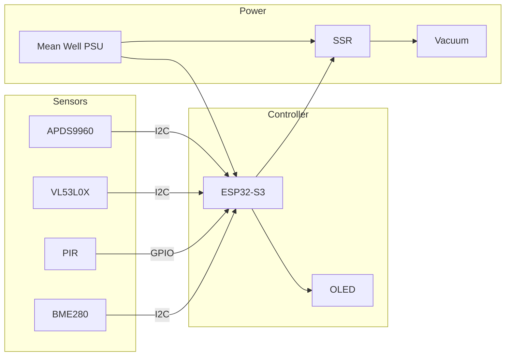

# Hardware Documentation

This section contains comprehensive hardware documentation for the ShopVac Rat Trap, including component specifications, electrical design, assembly instructions, and sensor placement.

## Documentation Overview

<div class="grid cards" markdown>

-   :material-format-list-bulleted:{ .lg .middle } __Bill of Materials__

    ---

    Complete component list with pricing and vendor information

    [:octicons-arrow-right-24: View BOM](bom.md)

-   :material-shopping:{ .lg .middle } __Component Sourcing__

    ---

    Where to buy components, bulk purchasing, and alternatives

    [:octicons-arrow-right-24: Sourcing Guide](sourcing.md)

-   :material-flash:{ .lg .middle } __Electrical Design__

    ---

    Wiring diagrams, power budgets, and safety compliance

    [:octicons-arrow-right-24: Electrical](electrical.md)

-   :material-tools:{ .lg .middle } __Assembly Guide__

    ---

    Step-by-step physical assembly instructions

    [:octicons-arrow-right-24: Assembly](assembly.md)

-   :material-radar:{ .lg .middle } __Sensor Logic__

    ---

    Detection system, sensor placement, and calibration

    [:octicons-arrow-right-24: Sensors](sensor-logic.md)

</div>

## Hardware Variants

### Standard Configuration

**ESP32-S3 Feather + ToF + PIR + APDS9960**

- Total cost: ~$150
- 17 components, all STEMMA QT
- No soldering required
- Offline detection logic
- Home Assistant integration

[:material-chevron-right: Build Standard Version](assembly.md)

### Camera Configuration

**Standard + OV5640 Camera + IR LED**

- Total cost: ~$190
- Adds visual classification
- 5MP autofocus camera
- High-power night vision
- Evidence capture

[:material-chevron-right: Build Camera Version](assembly.md#camera-variant)

## System Architecture



## Power Distribution

```
120V/230V AC Input
├─ Circuit Breaker (15A/10A)
├─ Fuse Protection
└─ Mean Well LRS-35-5 (5V/7A)
    ├─ ESP32-S3 (5V input)
    │   └─ Built-in 3.3V Regulator (600mA)
    │       ├─ APDS9960 (15mA)
    │       ├─ VL53L0X (30mA peak)
    │       ├─ PIR (5mA)
    │       ├─ BME280 (3.6mA)
    │       ├─ OLED (25mA peak)
    │       └─ Camera (100mA peak) [if equipped]
    └─ SSR Control Circuit
```

**Total 3.3V Load:**
- Standard: ~99mA (84% headroom) ✅
- Camera: ~249mA (58% headroom) ✅

## Component Categories

### Electronics (~65% of cost)

- ESP32-S3 controller
- Sensors (ToF, PIR, environmental)
- OLED display
- Power supply
- Solid state relay
- Safety components

[:octicons-arrow-right-24: Full BOM](bom.md)

### Mechanical (~15% of cost)

- Enclosure (Hammond PN-1334-C)
- 3D printed trap components
- Mounting hardware
- Cable management

[:octicons-arrow-right-24: 3D Models](https://github.com/bandwith/ShopVacRatTrap/tree/main/3d_models)

### Cables & Connectors (~10% of cost)

- STEMMA QT cables (various lengths)
- JST PH cables
- AC wiring (12 AWG)
- Terminal blocks

[:octicons-arrow-right-24: Sourcing Guide](sourcing.md)

### Safety Critical (~10% of cost)

- Circuit breaker
- Fuses
- Emergency stop switch
- Current transformer
- Optocoupler

[:octicons-arrow-right-24: Electrical Safety](electrical.md#safety-compliance)

## Build Complexity

| Aspect | Difficulty | Notes |
|--------|------------|-------|
| Component Sourcing | ⭐⭐☆☆☆ | Mostly Adafruit/Mouser |
| 3D Printing | ⭐⭐⭐☆☆ | 8-12 hours print time |
| Electronics Assembly | ⭐⭐☆☆☆ | No soldering needed |
| AC Wiring | ⭐⭐⭐⭐⭐ | **Requires electrical expertise** |
| Software Setup | ⭐⭐⭐☆☆ | ESPHome knowledge helpful |

!!! warning "AC Wiring Expertise Required"
    The AC power section requires knowledge of electrical codes and safety practices. If you're not comfortable working with AC voltage, hire a licensed electrician.

## Quality & Safety Standards

### Compliance

- **North America**: NEC, UL standards
- **Europe**: IEC, CE marking
- **Safety**: Optocoupler isolation, proper grounding
- **Protection**: Circuit breaker + fuse coordination

[:octicons-law-24: Compliance Details](electrical.md#safety-standards)

### Component Quality

- **Industrial Grade**: Mean Well PSU, Sensata SSR
- **Proven Sensors**: Adafruit breakouts, tested designs
- **Robust Design**: 4mm thick 3D prints, chew resistant
- **Professional Assembly**: No-solder STEMMA QT connectors

## Next Steps

1. **Review BOM** - Check component availability and pricing
2. **Source Components** - Order from recommended vendors
3. **3D Print Parts** - While waiting for components
4. **Study Electrical** - Understand wiring before assembly
5. **Follow Assembly** - Step-by-step build guide

---

<div style="text-align: center;">
    <a href="bom/" class="md-button md-button--primary">View Bill of Materials →</a>
</div>
