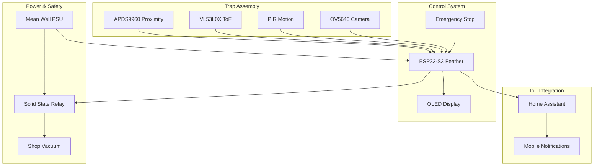

# ShopVac Rat Trap

    

!!! warning "Work in Progress"
    This project is under active development. Documentation, features, and hardware recommendations are subject to change.

## Professional IoT Rodent Control System

The ShopVac Rat Trap is a professional-grade, ESP32-based IoT rodent control system featuring:

- **🎯 Hybrid Detection**: APDS9960 + VL53L0X + PIR sensors (2 of 3 confirmation)
- **📸 5MP Camera**: Optional OV5640 with autofocus and night vision
- **🔌 Zero-Solder Assembly**: Complete STEMMA QT modular design
- **📊 OLED Display**: Integrated 128x64 status monitoring
- **🏠 Home Assistant**: Seamless ESPHome integration
- **⚡ Safety Compliant**: NEC/IEC electrical standards
- **🌍 Global Support**: 120V/230V configurations

## Quick Navigation

-   :material-clock-fast:{ .lg .middle } __Quick Start__

    ---

    Get started with building your rat trap in minutes

    [:octicons-arrow-right-24: Quick Start Guide](getting-started/quick-start.md)

-   :material-tools:{ .lg .middle } __Hardware__

    ---

    Complete hardware specifications, BOM, and assembly instructions

    [:octicons-arrow-right-24: Hardware Documentation](hardware/index.md)

-   :material-code-braces:{ .lg .middle } __Software__

    ---

    ESPHome configuration and Home Assistant integration

    [:octicons-arrow-right-24: Software Setup](software/index.md)

-   :material-book-open-variant:{ .lg .middle } __Reference__

    ---

    Troubleshooting, FAQ, and API reference

    [:octicons-arrow-right-24: Reference](reference/index.md)

## System Architecture

## Safety First

!!! danger "Electrical Hazard"
    This project involves 120V/230V AC electrical connections. Installation **MUST** be performed by qualified individuals with electrical experience. Improper installation can result in electrical shock, fire hazard, or equipment damage.

**Mandatory Safety Requirements:**
- Understanding of AC electrical safety and NEC/IEC code requirements
- Proper electrical tools and PPE (Personal Protective Equipment)
- Knowledge of local electrical codes and permit requirements
- Licensed electrician for AC wiring (if not qualified)

[:octicons-alert-24: Read Full Safety Guidelines](getting-started/safety.md){ .md-button .md-button--primary }

## Features in Detail

### Intelligent Detection

The trap uses a sophisticated "2 of 3" sensor confirmation system to eliminate false positives while ensuring reliable captures:

- **Primary**: APDS9960 proximity/gesture sensor
- **Secondary**: VL53L0X Time-of-Flight distance sensor
- **Tertiary**: PIR motion sensor backup
- **Optional**: OV5640 camera for visual evidence

[:material-radar: Learn About Sensor Logic](hardware/sensor-logic.md)

### Modular Design

Complete zero-solder assembly using STEMMA QT connectors:

- Plug-and-play sensor connections
- Easy maintenance and upgrades
- Chew-resistant 4mm thick 3D printed components
- Professional cable management

[:material-puzzle: Assembly Guide](hardware/assembly.md)

### Home Automation

Full integration with Home Assistant via ESPHome:

- Real-time capture notifications
- Historical data and trends
- Remote monitoring and control
- Automation triggers and actions

[:material-home-automation: Home Assistant Integration](software/home-assistant.md)

## Project Status

=== "Stable"
    - ESP32-S3 configuration
    - BOM and component sourcing
    - Electrical design
    - Basic assembly guide
    - ESPHome integration

=== "Beta"
    - Camera variant with OV5640
    - Computer vision classification
    - Advanced sensor calibration
    - Mobile app integration

=== "Planned"
    - Machine learning rodent identification
    - Multi-trap coordination
    - Cloud analytics dashboard
    - Professional enclosure options

## Getting Help

- **Documentation Issues**: [Open an issue](https://github.com/bandwith/ShopVacRatTrap/issues/new)
- **Questions**: [GitHub Discussions](https://github.com/bandwith/ShopVacRatTrap/discussions)
- **Community**: [Home Assistant Community](https://community.home-assistant.io)
- **ESPHome**: [ESPHome Discord](https://discord.gg/KhAMKrd)

## License & Credits

This project is open source and available under the [Apache 2.0 License](https://github.com/bandwith/ShopVacRatTrap/blob/main/LICENSE).

**Original Inspiration**: [Shop Rodent Stoppers Rat Vac](https://shoprodentstoppers.com/products/rat-vac-motion-sensor-rodent-catching-systems)

**Forked From**: [shellster/ShopVacRatTrap](https://github.com/shellster/ShopVacRatTrap)

---

    
Ready to build your own?

    <a href="getting-started/quick-start/" class="md-button md-button--primary">Get Started →</a>

