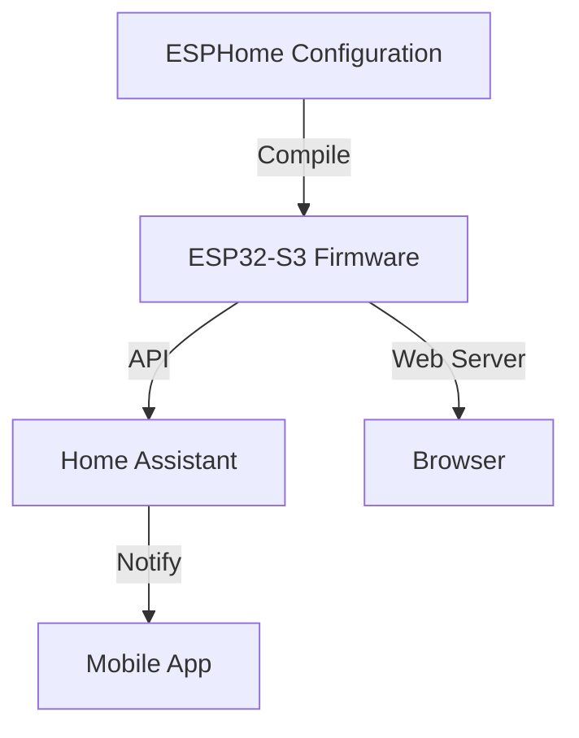

# Software Documentation

This section covers the software setup, ESPHome configuration, Home Assistant integration, and testing procedures for the ShopVac Rat Trap.

## Documentation Overview

<div class="grid cards" markdown>

-   :material-download:{ .lg .middle } __Installation__

    ---

    ESPHome setup, firmware flashing, and initial configuration

    [:octicons-arrow-right-24: Installation Guide](installation.md)

-   :material-file-code:{ .lg .middle } __ESPHome Config__

    ---

    Understanding the configuration, packages, and customization

    [:octicons-arrow-right-24: Configuration](esphome-config.md)

-   :material-test-tube:{ .lg .middle } __Testing__

    ---

    Validation, calibration, and troubleshooting procedures

    [:octicons-arrow-right-24: Testing Guide](testing.md)

-   :material-home-automation:{ .lg .middle } __Home Assistant__

    ---

    Integration, automations, and dashboard examples

    [:octicons-arrow-right-24: HA Integration](home-assistant.md)

</div>

## Software Architecture

The ShopVac Rat Trap uses **ESPHome** as its firmware platform, providing:

- Configuration-as-code approach
- Automatic Home Assistant integration
- OTA (Over-The-Air) updates
- Web-based interface
- Robust sensor handling



## Configuration Structure

The trap uses a modular ESPHome configuration with packages:

```
esphome/
├── rat-trap.yaml              # Standard variant
├── rat-trap-stemma-camera.yaml    # Camera variant
├── secrets.yaml                     # WiFi & credentials
└── packages/
    ├── common.yaml                  # Common settings
    ├── sensors.yaml                 # Sensor configs
    ├── safety.yaml                  # Safety features
    ├── display-base.yaml            # OLED display
    ├── rat-trap-base.yaml           # Core logic
    └── camera.yaml                  # Camera support
```

**Benefits of packages:**

- Reusable components
- Easier maintenance
- Cleaner organization
- Variant support

[:octicons-arrow-right-24: Learn More](esphome-config.md)

## Key Features

### Intelligent Detection

"2 of 3" sensor confirmation with configurable thresholds:

```yaml
# Adjustable via Home Assistant
detection_threshold: 150mm        # ToF distance
apds_proximity_threshold: 50      # APDS sensitivity
vacuum_runtime: 8s                # Vacuum duration
cooldown_period: 30s              # Retrigger delay
```

### Safety Systems

Built-in thermal and electrical protection:

- **ESP32 Temperature Monitoring**: Auto-shutdown at 85°C
- **Emergency Stop**: Immediate vacuum cutoff
- **Thermal Warnings**: Progressive alerts at 75°C/85°C
- **Fault Tracking**: System diagnostics and logging

### OTA Updates

Secure remote firmware updates:

```yaml
ota:
  - platform: esphome
    password: !secret ota_password
```

Update via:
- ESPHome command line
- Home Assistant ESPHome add-on
- Web interface

### Web Server

Built-in web interface for:

- Real-time sensor readings
- Manual vacuum trigger
- System diagnostics
- Configuration changes
- Log viewing

Access at: `http://rat-trap-ip/`

## Home Assistant Integration

Automatic entity discovery provides:

### Sensors

- Distance measurement (mm)
- Environmental conditions
- System temperature
- WiFi signal strength
- Capture count
- Vacuum runtime

### Binary Sensors

- Rodent detected
- Trap triggered
- PIR motion
- Emergency stop status

### Controls

- System arm/disarm
- Manual trigger
- Reset button
- Threshold adjustments

### Automations

Example notification automation:

```yaml
automation:
  - alias: "Rat Trap Alert"
    trigger:
      platform: state
      entity_id: binary_sensor.rat_trap_rodent_detected
      to: 'on'
    action:
      service: notify.mobile_app
      data:
        message: "Rodent captured!"
        data:
          tag: rat_trap
          priority: high
```

[:octicons-arrow-right-24: More Examples](home-assistant.md)

## Development Workflow

### 1. Local Development

```bash
# Clone repository
git clone https://github.com/bandwith/ShopVacRatTrap.git
cd ShopVacRatTrap/esphome

# Edit configuration
nano rat-trap.yaml

# Validate
esphome config rat-trap.yaml

# Test build
esphome compile rat-trap.yaml
```

### 2. Initial Flashing

```bash
# Via USB
esphome upload rat-trap.yaml --device /dev/ttyUSB0

# Monitor logs
esphome logs rat-trap.yaml
```

### 3. OTA Updates

```bash
# After initial flash, updates over WiFi
esphome upload rat-trap.yaml --device rat-trap-ip
```

### 4. Testing & Validation

```bash
# Run system diagnostics
# Use Home Assistant service call:
# esphome.rat_trap_2025_run_diagnostics
```

[:octicons-arrow-right-24: Testing Guide](testing.md)

## Version Control

Track your configuration in Git:

```bash
# Create branch for customizations
git checkout -b my-custom-config

# Make changes
git add esphome/rat-trap.yaml
git commit -m "Adjust detection thresholds"

# Merge upstream updates
git fetch upstream
git merge upstream/main
```

## Troubleshooting

Common issues and solutions:

| Issue | Solution |
|-------|----------|
| Won't connect to WiFi | Check credentials, signal strength |
| Sensors not detected | Verify I2C addresses, check cables |
| Vacuum won't trigger | Check emergency stop, SSR connection |
| OTA fails | Use USB fallback, check network |

[:octicons-tools-24: Full Troubleshooting Guide](../reference/troubleshooting.md)

## Next Steps

1. **Install ESPHome** - Set up development environment
2. **Configure WiFi** - Update secrets.yaml
3. **Flash Firmware** - Initial USB programming
4. **Test Sensors** - Verify all components
5. **Add to HA** - Integrate with Home Assistant

---

<div style="text-align: center;">
    <a href="installation/" class="md-button md-button--primary">Start Installation →</a>
</div>
